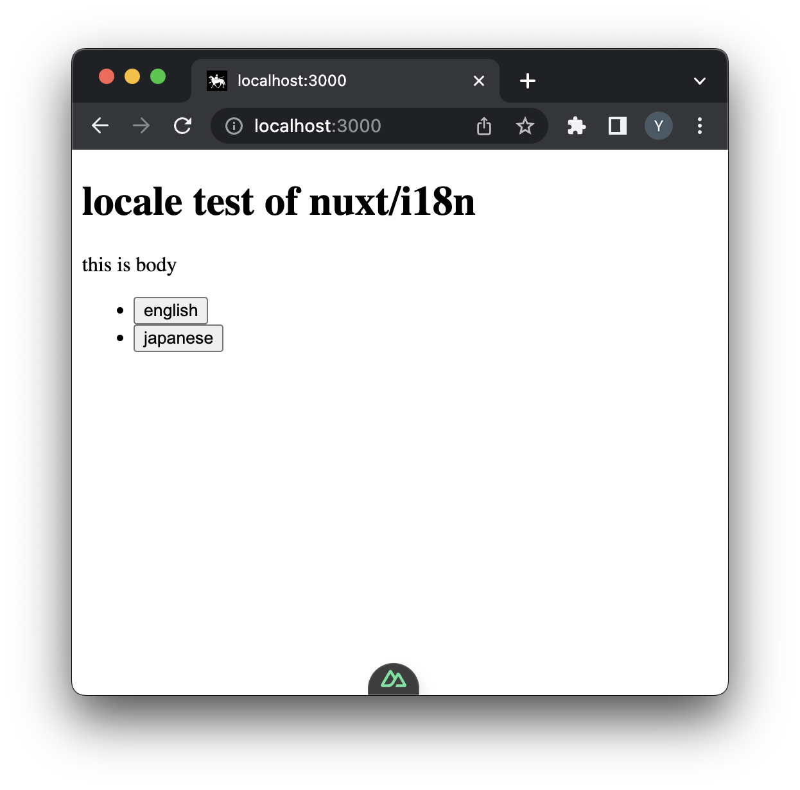
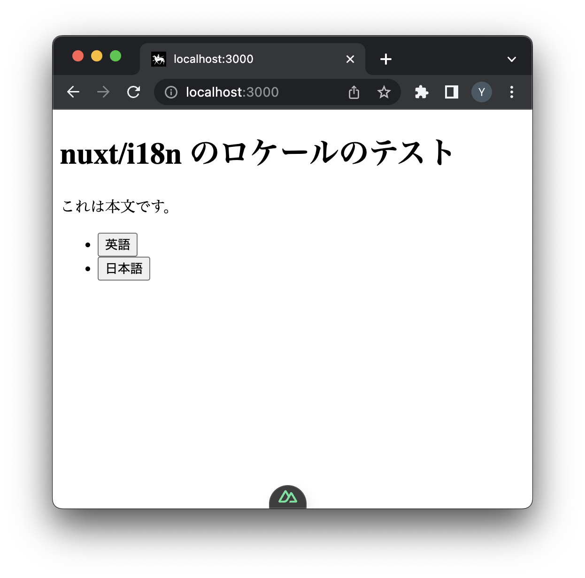
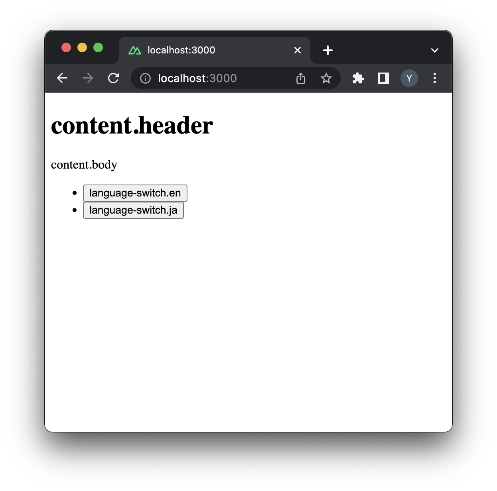

# @nuxt/i18n resource problem

this repository aims to represent a bug, which occurs under an enviroment with nuxt (3.5.2) + @nuxt/i18n (8.0.0-beta.12).

## Problematic
with ```nuxt dev``` works.
```
❯ yarn dev
yarn run v1.22.18
$ nuxt dev
  > Local:    http://localhost:3000/
        :
        :
✔ Nuxt Devtools is enabled v0.5.5 ℹ Vite client warmed up in 710ms
✔ Nitro built in 379 ms
✔ Vite server hmr 21 files in 822.595ms
```





but with ```nuxt preview``` does not work.

```
❯ yarn preview
yarn run v1.22.18
$ nuxt preview
Nuxi 3.5.3
ℹ Node.js version: 19.4.0
ℹ Preset: node-server
ℹ Working dir: .output
ℹ Loading .env. This will not be loaded when running the server in production.
ℹ Starting preview command: node ./server/index.mjs

Listening http://[::]:3000
@nuxtjs/i18n Cannot find module '/Users/an-user/work/nuxt-i18n-prerender-problem/.output/public/__i18n__/prerender/e525609c.js' imported from /Users/an-user/work/nuxt-i18n-prerender-problem/.output/server/chunks/app/_nuxt/i18n.options-810bdec2.mjs
[nuxt] [request error] [unhandled] [500] Cannot read properties of null (reading 'e525609c')
  at ./server/chunks/nitro/node-server.mjs:813:26
  at process.processTicksAndRejections (node:internal/process/task_queues:95:5)
  at async Object.handler (./server/node_modules/h3/dist/index.mjs:1255:19)
  at async Server.toNodeHandle (./server/node_modules/h3/dist/index.mjs:1330:7)
```


